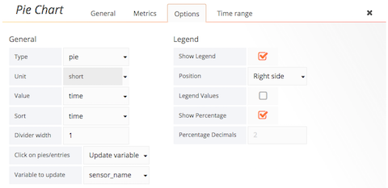
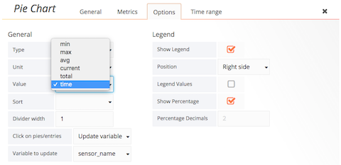
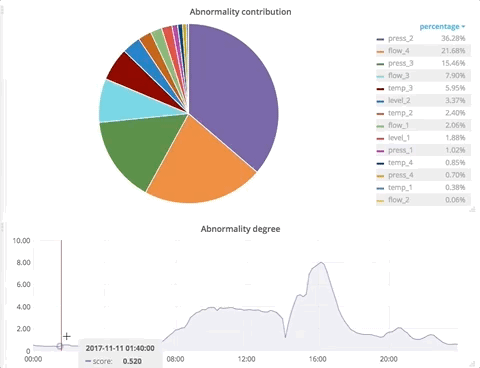
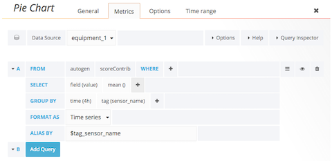

# Interactive pie chart for Grafana 

A Grafana pie chart panel based on [grafana/piechart-panel](https://github.com/grafana/piechart-panel) with additional functionality. It focuses on interaction with other Grafana panels via template variables and internal events. 

## Update template variable

You can configure the behavior of clicking on a slice and a legend entry of the chart. You can choose between updating a template variable of your Grafana dashboard or hiding a slice in a pie chart. If you choose to update a template variable, you need to choose which variable to update.

When you click on a slice, it adds the label of the slice to the list of selected values of a template variable; if the slice is already in the list, it removes the label from the list. The same thing happens when you click on an entry in the legend; see demo below.

## Update pie chart when receiving events from other panels

[grafana/piechart-panel](https://github.com/grafana/piechart-panel) is just a static chart. To use it, you first need to group time series by tag. Then you need to specify how to aggregate the values of each tag group using one of the aggregators: min, max, avg, current (last), and total. The panel shows the same chart unless configured with another aggregator. It does not respond to events from other panels.

[eastcirclek/piechart-panel](https://github.com/eastcirclek/piechart-panel) allows users to draw a dynamic pie chart. While you hover over other panels that generate the graph-hover events in which time information is embedded, a dynamic pie chart catches and parses the graph-hover events, and updates itself by using a set of values for the time. To enable this dynamic pie chart, you need to configure your pie chart as follows:

Below is an example of updating a dynamic pie chart by hovering over the default Grafana graph panel that generates graph-hover events.

 
To prevent from loading large data to your browser, you need to group time-series not only by tag but also by time as shown below:

Then you'll have less frequent updates on your pie chart.

 